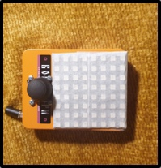
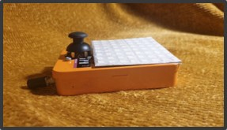
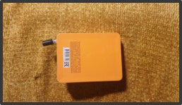
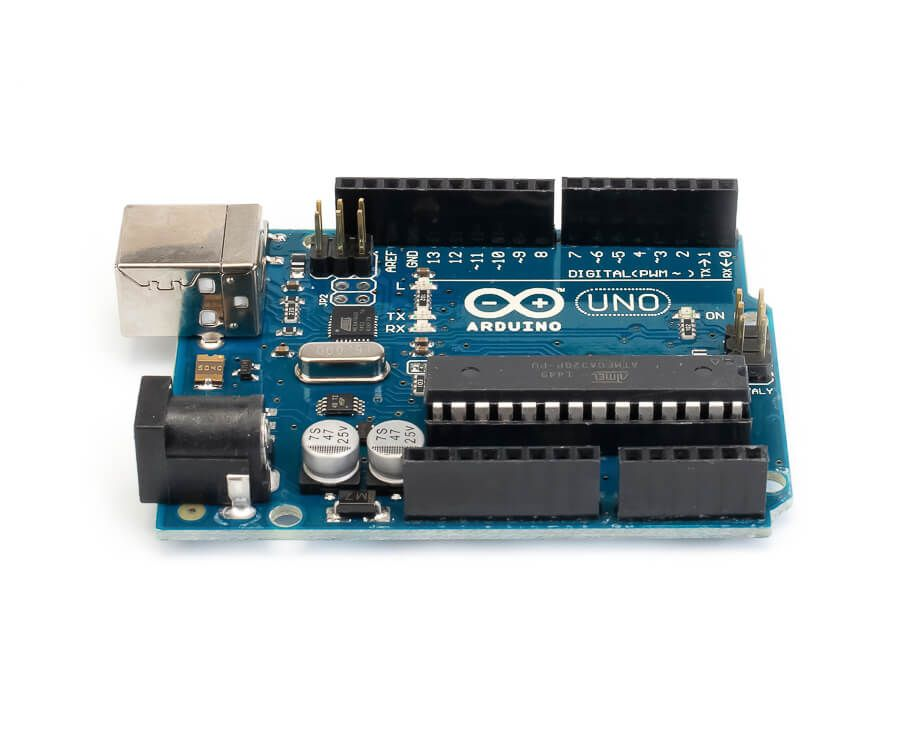
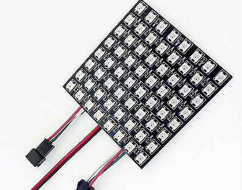
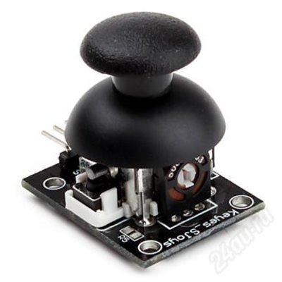

## Игра "Змейка"

## Демонстрация устройства

## Список компонентов
- Arduino UNO
- Батарейка "Крона"
- Коннектор для батарйки 
- Матрица ws2812b (8x8) 
- Резистор (200-500 Ом)
- Джойстик 

## Подключение
В скетче ожидается, что матрица подключена к 12 пину, оси джойстика к пинам A1 и A2, кнопка джойстика к пину 8.
